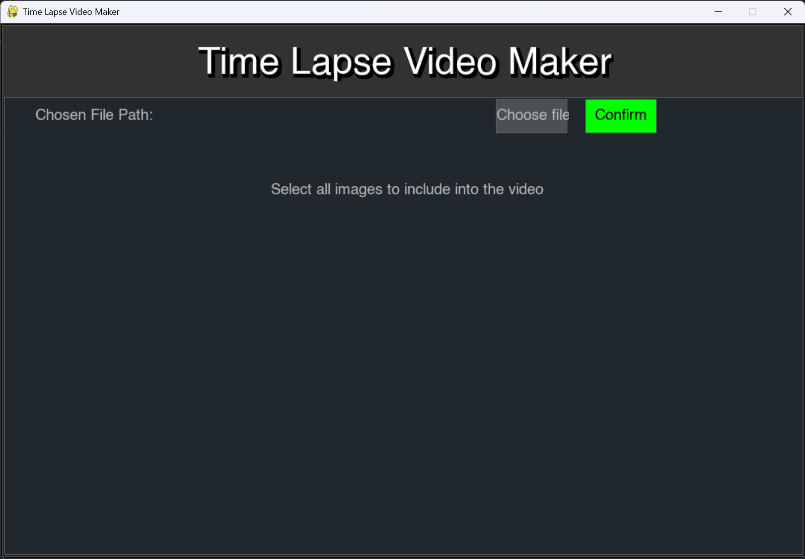
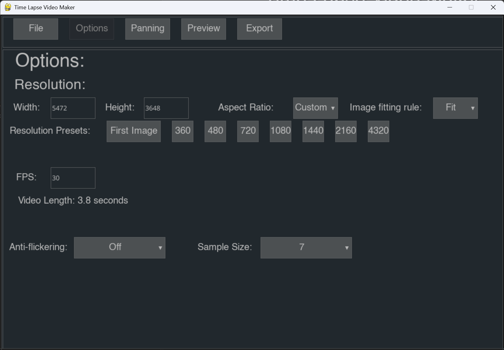
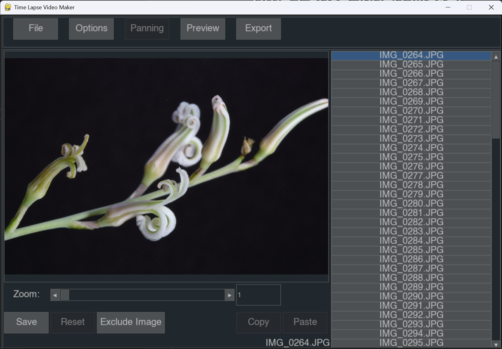
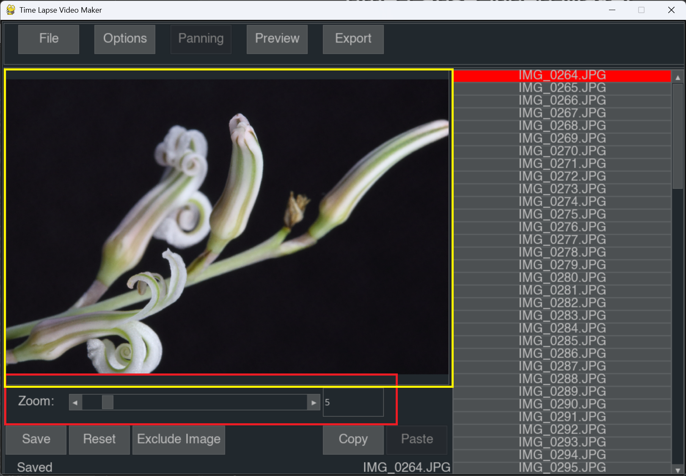
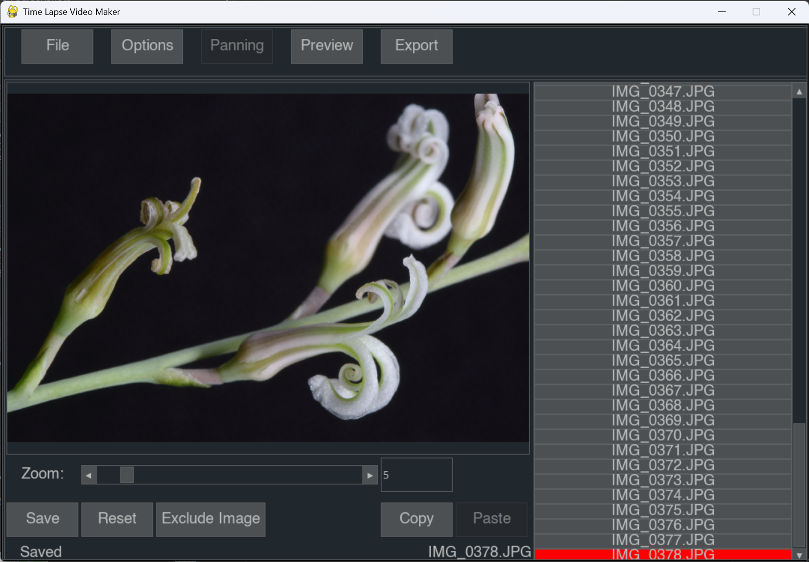
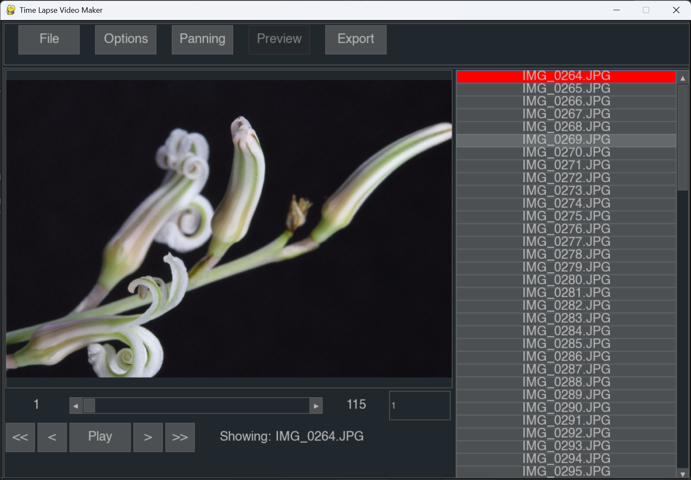
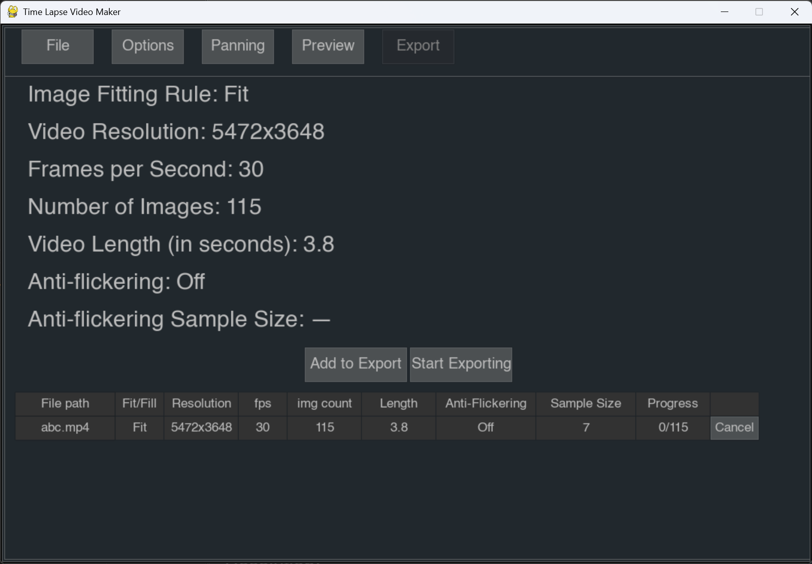

# Time-Lapse Video Maker

## Introduction
A Python-based tool designed to create high-quality time-lapse videos from a series of images. This project allows for simple video zooming and panning, and various export options to help automate the process of turning photo sequences into cinematic videos.

## How to Run
To get this project running on your local machine, follow these steps:

1. **Clone the repository:**
   ```bash
   git clone <repository-url>
   cd time-lapse-video-maker
   ```

2. **Set up a virtual environment (Recommended):**
   ```bash
   python -m venv env
   # Activate on Windows:
   .\env\Scripts\activate
   # Activate on macOS/Linux:
   source env/bin/activate
   ```
   Note that you should use python on version 3.10 or higher. 

3. **Install dependencies:**
   ```bash
   pip install -r requirements.txt
   ```

4. **Launch the application:**
   ```bash
   python app.py
   ```

## How to Use
### 1. Select source images
   - Click "Choose file"
   - Find the folder with all your images, and select all of the images
   - A filepath should appear after "Chosen File Path", then click confirm

---
### 2. Options
   - You may change different export settings here

---
### 3. Panning
   - Create panning and zooming effects here

   - Modify zoom level in the red box
   - Drag the image in the yellow box to move the window position

   - Select another image, modify zoom and window position to get the moving panning effect
   - The image selector on the right hand side shows whether you have modified the settings for a specific image, blue is the currently selected image, red means there's saved settings for that image

---
### 4. Preview
   - You can see how the panning and zooming effects are here
   - Note that the display is not played at your selected FPS

---
### 5. Export
   - First click Add to Export, type the filename and press "save"
   - Then click Start Exporting
